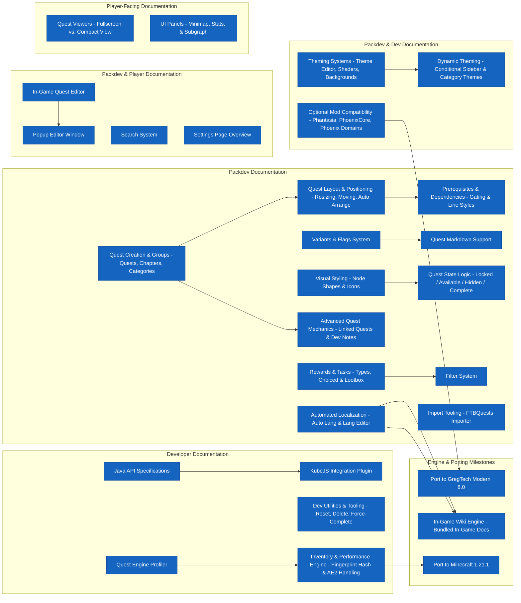

<h1 align="center">
  
</h1>

  <strong>Create your favorite documentation; thinly disguised as a mod or an interconnected story. 
    It's your choice (or not).</strong>

  
  
  

# Phoenix Chronicles
Chronicles is a simple 1.20.1 questbook mod made to solve the niche and vast issues when making a questbook for your modpack.

It is focused on trying to integrate with the community, provide everything a questbook mod would need, and throw some more into the mix.

It has compat for
- Gregtech:Modern
- Phoenix Guilds
- Phantasia
- PhoenixCore
- FTBTeams
It also depends on PhoenixWiki for the shared theming with the rest of the PhoenixSuite 

Made to be an alternative to **FTBQuests** (or ftbq) but still have its own unique feel and cadence. 
There is a built-in **FTBQuests** importer that can handle importing 
*quests, player progress, chapters, categories, rewards, and tasks*.
Though `filter tasks` will have to be remade since those use a seperate mod not in base **FTBQuests**.

## Wiki link
We have a small in progress wiki for all PhoenixSuite mods, if it is missing any important info or you would like to help,
feel free to ping me on discord by the username of Phoenixvine.

[Wiki](https://omicron-industries.github.io/PhoenixSuite/wiki/) 

# Getting started as a dev and/or packdev.
You will need the minecraft development plugin and the mermaid plugin.
The minecraft formatting colors plugin is also highly suggested. 
Checking the wiki is also very helpful as well as there being some more resources down below.
And ofc last but not least feel free to ask for help in the discord

## Major feature list.
Below is a chart of the major features and how they compare to other mods in Chronicle's niche.
There is also a chart of what we do better or at parity to what others do.
For more information on any of the features, check the wiki (or if that doesn't exist) ping Phoenixvine on discord.

Legend: PR = At Parity, AA = Advantage, PA = Partial.

| Feature                           | Chronicles                                     | FTB Quests                         | Parity / Advantage                     |
|:----------------------------------|:-----------------------------------------------|:-----------------------------------|:---------------------------------------|
| **GregTech Integration**          | Built-in native support for GT recipes & tiers | Requires third-party addon scripts | **Advantage** (Out-of-the-box support) |
| **Quest Editor Gui**              | Lightweight, custom layout rendering           | Heavy, highly configurable GUI     | **Parity** (Different style focus)     |
| **Custom External tasks**         | Custom player capability tracking              | Custom data attachments            | **AA**                                 |
| **Packet Syncing**                | Optimized light payload network packets        | Standard networking pipeline       | **Advantage** (Lower bandwidth)        |
| **Third-Party Mod Compatibility** | Direct Mixin & API bridges                     | Extensive integrations             | **In Progress**                        |

# Roadmap
Below is a loose roadmap of what we plan to do in the future.

# Small snippt of the markdown of quests.

# Credits
- Thanks to FTBQuests for some feature ideas and things to do a bit better.
- Thanks to Omicron Industries (especially PlasmaticVoid) for their help in refining the project.
- Thanks to [Jambon](https://github.com/Jambon123), FyreDrakon, and KaiTheExaminer
for helping test out the mod and giving some suggestions.
- Thanks to [Rose](https://github.com/Lilac-Rose) for adding porting over ftb quest player data. 
"slanderous of ftbquestsl; stupid fucking formatting" Lilac Aria Rose; 2026

# Ai disclosure.
A sizeable portion of the code has been written by ai. Refactoring is currently ongoing.
All text in the mod is currently being taken apart and being rewritten by a real human, and all documentation is written 
by humans.

# Where to go next.
Contributing
See CONTRIBUTING.md. (Note, WIP. Feel free to ask Phoenix questions if anything is unclear)

Architecture Decisions 
See Architecture.md. (Note, WIP. Feel free to ask Phoenix questions if anything is unclear)

Frequently Asked Questions
See FAQ.md (Note, this is not complete. More entries will be added as questions are asked.)

Known Issues
See KNOWN-ISSUES.md (Note, currently empty. Want to be the first?)